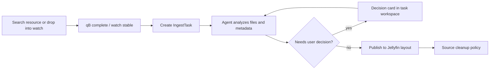

# Media Pilot

[中文](README.md) | **English**

Media Pilot is an Agent-first media acquisition and library-ingest tool for personal media servers. It connects resource search, qBittorrent downloads, watch-folder imports, metadata matching, Jellyfin-style publishing, and source cleanup into a traceable task flow. When metadata, target paths, subtitles, or input structure are ambiguous, it asks for confirmation in the task workspace instead of hiding the problem in logs.

> This project is still under active development. Start with a small watch folder and a conservative source-cleanup policy before pointing it at a full production library.

## Features

- **Managed downloads**: Search through Prowlarr, download with qBittorrent, then automatically create ingest tasks.
- **Watch imports**: Scan top-level files or folders only after their recursive snapshot is stable.
- **Agent-driven ingest**: The Agent analyzes inputs, searches metadata, resolves candidates, handles conflicts, and publishes through controlled tools.
- **Movies, shows, and adult movies**: TMDB for movies and shows; TPDB `/jav` for adult movies with a separate library root.
- **Jellyfin layout**: Writes media files, NFO, poster, fanart, and logo assets.
- **Task workspace**: Per-task Agent conversation, decision cards, tool summaries, revoke publish, and source cleanup actions.
- **Docker onboarding**: Compose initializes Prowlarr API keys, qBittorrent credentials, and default public indexers.

## Current Capabilities and Roadmap

Currently supported:

- TMDB movie ingest
- TMDB show ingest, including season-based and absolute episode numbering
- TPDB `/jav` adult movie ingest
- Prowlarr search and qBittorrent download handoff
- Watch-folder external imports
- Jellyfin-style folders and NFO files
- Agent decisions with human confirmation
- Source keep / trash / delete-confirm cleanup policies

Potential future work:

- More metadata providers and scraping services
- Media-library layouts and metadata formats beyond Jellyfin
- Accounts, permissions, and privacy separation for home-network deployments
- More granular download-client and indexer management

These areas will be driven by real usage feedback. The current priority is a reliable single-node Docker deployment and a stable Agent ingest path.

## Disclaimer

Media Pilot is a self-hosted automation tool for organizing and importing media into a personal library. The project does not provide, host, index, or distribute any media content, and does not encourage or assist with obtaining unauthorized content.

Users are solely responsible for ensuring that their sources, downloads, metadata usage, library contents, and access controls comply with applicable laws, regulations, and third-party terms of service. Any copyright, privacy, adult-content access control, or other compliance responsibility arising from use of this project belongs to the user.

If your deployment may be accessible by family members or other users, configure appropriate network restrictions, reverse-proxy authentication, or other access controls.

## Flow



## Quick Start

Requirements:

- Docker and Docker Compose
- An OpenAI-compatible LLM API
- A TMDB API key

```bash
mkdir media-pilot
cd media-pilot
curl -fsSLO https://raw.githubusercontent.com/suqianshi92/media-pilot/main/docker-compose.yml
curl -fsSLO https://raw.githubusercontent.com/suqianshi92/media-pilot/main/.env.example
cp .env.example .env
```

Edit `.env` and fill at least:

```dotenv
MEDIA_PILOT_IMAGE=suqianshi/media-pilot:latest
MEDIA_PILOT_LLM_API_KEY=sk-your-api-key
MEDIA_PILOT_LLM_BASE_URL=https://api.openai.com/v1
MEDIA_PILOT_LLM_MODEL=gpt-4o-mini
MEDIA_PILOT_TMDB_API_KEY=your-tmdb-api-key
```

Start the stack:

```bash
docker compose up -d
```

Default URLs:

- Web UI: `http://127.0.0.1:8000/app/`
- Prowlarr: `http://127.0.0.1:9696/`
- qBittorrent: `http://127.0.0.1:8088/`

Prowlarr API keys and qBittorrent WebUI credentials are generated by `media-pilot-init` and stored in shared secrets. See [Deployment and Troubleshooting](docs/deployment.md) for manual takeover and recovery steps.

## Key Configuration

Most Docker deployments only need these variables:

In Docker deployments, directory variables are **host mount paths**. The application sees fixed container paths such as `/data/downloads`, `/data/watch`, `/data/library/...`, and `/data/trash`.

| Variable | Purpose |
| --- | --- |
| `MEDIA_PILOT_DOWNLOADS_DIR` | qBittorrent download directory |
| `MEDIA_PILOT_WATCH_DIR` | External import watch directory |
| `MEDIA_PILOT_WORKSPACE_DIR` | Working directory |
| `MEDIA_PILOT_MOVIES_DIR` | Movie library root |
| `MEDIA_PILOT_SHOWS_DIR` | Show library root |
| `MEDIA_PILOT_ADULT_MOVIES_DIR` | Optional adult movie library root |
| `MEDIA_PILOT_TRASH_DIR` | Source-file trash directory |
| `MEDIA_PILOT_DATABASE_DIR` | SQLite database directory |
| `MEDIA_PILOT_LLM_API_KEY` / `BASE_URL` / `MODEL` | Agent LLM configuration |
| `MEDIA_PILOT_TMDB_API_KEY` | TMDB metadata |
| `MEDIA_PILOT_TPDB_API_KEY` | Optional TPDB adult metadata |

Advanced variables are documented in [Deployment and Troubleshooting](docs/deployment.md#高级环境变量).

## Startup Requirements

The background worker validates key configuration at process startup. If LLM / TMDB configuration is missing or required directories are unavailable, the Web UI may still start, but automated background processing will not run. Restart the container after fixing environment variables; Agent runs and the worker do not hot-reload startup configuration.

When `tpdb_adult_movie` is enabled, both `MEDIA_PILOT_TPDB_API_KEY` and a usable `MEDIA_PILOT_ADULT_MOVIES_DIR` are required. Adult movies are never silently routed to the normal movie library.

## Output Layout

Movies use a Jellyfin-style folder:

```text
Movie Title (Year)/
  Movie Title (Year) [quality].mkv
  movie.nfo
  Movie Title (Year)-poster.jpg
  Movie Title (Year)-fanart.jpg
  Movie Title (Year)-clearlogo.png
```

Shows are written as `show / season / episode`, with `tvshow.nfo`, `season.nfo`, and `episode.nfo`.

Poster download failure fails the publish operation. Fanart and clearlogo failures only produce warnings.

## Local Development

After cloning the source tree, use the development override when you want to
build the local image:

```bash
git clone https://github.com/suqianshi92/media-pilot.git
cd media-pilot
cp .env.example .env
docker compose -f docker-compose.yml -f docker-compose.dev.yml build media-pilot
docker compose -f docker-compose.yml -f docker-compose.dev.yml up -d
```

Backend:

```bash
uv sync
uv run python -m media_pilot
```

Frontend:

```bash
cd frontend
npm install
npm run dev
```

Checks:

```bash
uv run python -m pytest
cd frontend && npm run typecheck && npm run test
```

## Documentation

- [Deployment and troubleshooting](docs/deployment.md)
- [JSON API](docs/api.md)
- [Frontend development](docs/frontend.md)
- [Development workflow](docs/local-git-workflow.md)
- [Domain glossary](CONTEXT.md)
