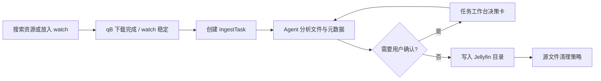

# Media Pilot

**中文** | [English](README.en.md)

Media Pilot 是一个面向个人媒体库的 Agent-first 下载与入库工具。它把资源搜索、下载接管、watch 目录导入、元数据匹配、Jellyfin 风格落盘和源文件清理串成一条可追踪的任务流；遇到候选不明确、目标冲突或复杂输入时，会在任务工作台里请求用户确认，而不是把问题藏在日志里。

> 项目仍处于活跃开发阶段。建议先用小范围 watch 目录和保留源文件策略试运行，再接入正式媒体库。

## 能做什么

- **托管下载**：通过 Prowlarr 搜索资源，交给 qBittorrent 下载，完成后自动进入入库任务。
- **外部导入**：监听 watch 目录，等待文件 / 目录稳定后创建入库任务，避免复制大文件时提前处理。
- **Agent 入库主线**：Agent 使用受控工具分析文件、搜索元数据、判断候选、处理冲突并推进发布。
- **电影 / 剧集 / 成人影片分流**：普通电影和剧集走 TMDB；成人影片可走 TPDB `/jav`，并发布到独立成人影片库根。
- **Jellyfin 风格输出**：生成媒体文件、NFO、poster、fanart、logo 等目录结构。
- **任务工作台**：每个任务有 Agent 对话、决策卡、工具调用摘要、撤回入库和源文件清理入口。
- **内置部署初始化**：Docker Compose 会自动生成 Prowlarr API Key、qBittorrent WebUI 密码，并初始化默认公共 indexer。

## 当前能力与后续方向

当前已覆盖：

- TMDB 电影入库
- TMDB 分季 / 绝对集数剧集入库
- TPDB 官方 `/jav` 成人影片入库
- Prowlarr 搜索 + qBittorrent 下载接管
- watch 外部导入
- Jellyfin 风格目录与 NFO
- 任务内 Agent 决策与用户确认
- 源文件保留 / 回收 / 删除确认策略

后续可能扩展：

- 更多元数据源和刮削服务
- Jellyfin 之外的媒体库目录 / 元数据格式
- 家庭网络部署下的账号、权限与隐私隔离
- 更细的下载器与 indexer 管理能力

这些方向会根据真实使用反馈逐步推进，当前版本优先保证单机 Docker 部署和 Agent 入库主链路稳定。

## 免责声明

Media Pilot 是一个自托管的媒体整理与入库自动化工具。项目本身不提供、不托管、不索引任何媒体资源，也不鼓励或协助获取未授权内容。

使用者需要自行确保资源来源、下载行为、元数据使用、媒体库内容和访问权限符合所在地区法律法规及相关服务条款。因使用本项目产生的版权、隐私、成人内容访问控制或其他合规责任，均由使用者自行承担。

如果你的部署环境可能被家庭成员或其他用户访问，请自行配置网络访问控制、反向代理认证或其他权限保护措施。

## 工作流



## 快速开始

要求：

- Docker 和 Docker Compose
- 一个可用的 LLM OpenAI-compatible API
- TMDB API Key

```bash
mkdir media-pilot
cd media-pilot
curl -fsSLO https://raw.githubusercontent.com/suqianshi92/media-pilot/main/docker-compose.yml
curl -fsSLO https://raw.githubusercontent.com/suqianshi92/media-pilot/main/.env.example
cp .env.example .env
```

编辑 `.env`，至少填写：

```dotenv
MEDIA_PILOT_IMAGE=suqianshi/media-pilot:latest
MEDIA_PILOT_LLM_API_KEY=sk-your-api-key
MEDIA_PILOT_LLM_BASE_URL=https://api.openai.com/v1
MEDIA_PILOT_LLM_MODEL=gpt-4o-mini
MEDIA_PILOT_TMDB_API_KEY=your-tmdb-api-key
```

启动：

```bash
docker compose up -d
```

默认入口：

- Web UI: `http://127.0.0.1:8000/app/`
- Prowlarr: `http://127.0.0.1:9696/`
- qBittorrent: `http://127.0.0.1:8088/`

Prowlarr API Key 与 qBittorrent WebUI 密码由 `media-pilot-init` 自动生成并写入共享 secrets。排障和手动接管见 [部署与排障](docs/deployment.md)。

## 关键配置

首次部署通常只需要关注这些变量：

Docker 部署中，目录变量表示**宿主机挂载路径**；容器内应用路径固定为 `/data/downloads`、`/data/watch`、`/data/library/...` 和 `/data/trash`。

| 变量 | 用途 |
| --- | --- |
| `MEDIA_PILOT_DOWNLOADS_DIR` | qBittorrent 下载目录 |
| `MEDIA_PILOT_WATCH_DIR` | 外部导入 watch 目录 |
| `MEDIA_PILOT_WORKSPACE_DIR` | 工作区目录 |
| `MEDIA_PILOT_MOVIES_DIR` | 普通电影库根 |
| `MEDIA_PILOT_SHOWS_DIR` | 剧集库根 |
| `MEDIA_PILOT_ADULT_MOVIES_DIR` | 成人影片库根，可选 |
| `MEDIA_PILOT_TRASH_DIR` | 源文件回收区目录 |
| `MEDIA_PILOT_DATABASE_DIR` | SQLite 数据目录 |
| `MEDIA_PILOT_LLM_API_KEY` / `BASE_URL` / `MODEL` | Agent LLM 配置 |
| `MEDIA_PILOT_TMDB_API_KEY` | TMDB 元数据 |
| `MEDIA_PILOT_TPDB_API_KEY` | TPDB 成人影片元数据，可选 |

更多高级变量见 [部署与排障](docs/deployment.md#高级环境变量)。

## 后台启动限制

后台 worker 在进程启动时校验关键配置。缺少 LLM / TMDB 配置，或目录不可用时，Web UI 仍可打开，但后台自动处理不会启动。修正环境变量后需要重启容器；Agent run 和后台 worker 不会热加载启动配置。

启用 `tpdb_adult_movie` 档案时，必须同时配置 `MEDIA_PILOT_TPDB_API_KEY` 和可用的 `MEDIA_PILOT_ADULT_MOVIES_DIR`。系统不会把成人影片静默 fallback 到普通电影库。

## 输出结构

电影默认写入 Jellyfin 风格目录：

```text
电影标题 (年份)/
  电影标题 (年份) [质量信息].mkv
  movie.nfo
  电影标题 (年份)-poster.jpg
  电影标题 (年份)-fanart.jpg
  电影标题 (年份)-clearlogo.png
```

剧集写入 `show / season / episode` 三层目录，并生成 `tvshow.nfo`、`season.nfo` 和 `episode.nfo`。

`poster` 下载失败会导致本次发布失败；`fanart` / `clearlogo` 下载失败只记录 warning，不阻塞发布。

## 本地开发

克隆源码后，如需构建本地镜像，使用开发 override：

```bash
git clone https://github.com/suqianshi92/media-pilot.git
cd media-pilot
cp .env.example .env
docker compose -f docker-compose.yml -f docker-compose.dev.yml build media-pilot
docker compose -f docker-compose.yml -f docker-compose.dev.yml up -d
```

后端：

```bash
uv sync
uv run python -m media_pilot
```

前端：

```bash
cd frontend
npm install
npm run dev
```

常用检查：

```bash
uv run python -m pytest
cd frontend && npm run typecheck && npm run test
```

## 文档

- [部署与排障](docs/deployment.md)
- [JSON API](docs/api.md)
- [前端开发](docs/frontend.md)
- [开发工作流](docs/local-git-workflow.md)
- [领域词汇](CONTEXT.md)
